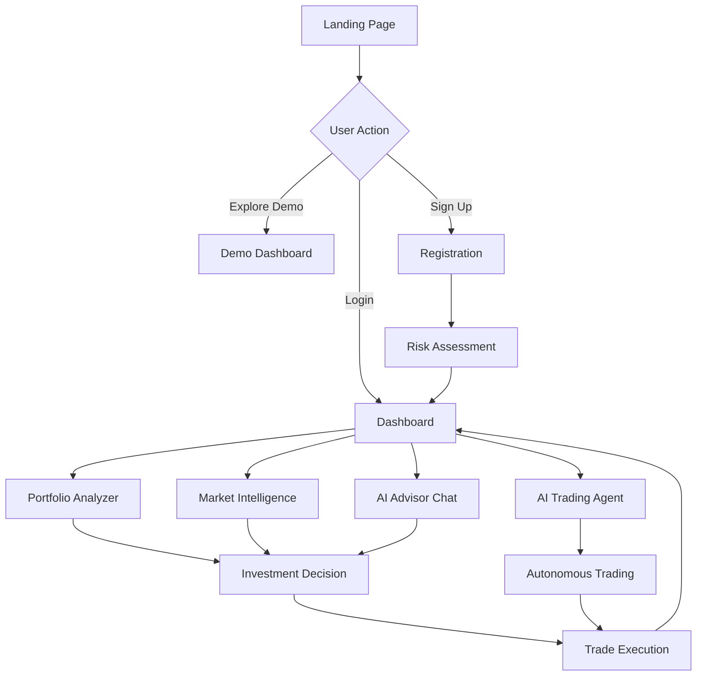

## 1. Product Overview
AI Investment Advisor is a modern, premium dashboard that transforms complex financial data into beautiful, actionable insights. The platform helps users make informed investment decisions through AI-powered analytics, real-time market data, and personalized recommendations.

The product solves the problem of overwhelming financial information by presenting it in an engaging, intuitive interface that keeps users invested in their financial journey rather than frustrated by complexity.

Target market: Individual investors, financial advisors, and wealth management professionals seeking a sophisticated yet accessible investment analysis platform.

## 2. Core Features

### 2.1 User Roles
| Role | Registration Method | Core Permissions |
|------|---------------------|------------------|
| Free User | Email registration | View basic market data, limited portfolio tracking, 3 AI queries per day |
| Premium User | Subscription upgrade | Unlimited AI queries, advanced analytics, portfolio optimization, real-time alerts |
| Professional User | Enterprise subscription | Multi-portfolio management, client reporting, API access, white-label options |

### 2.2 Feature Module
Our AI Investment Advisor consists of the following main pages:
1. **Dashboard**: Real-time market overview, portfolio summary, AI insights widget, watchlist, trading agent status
2. **Portfolio Analyzer**: Asset allocation visualization, risk assessment, performance metrics, AI recommendations
3. **Market Intelligence**: Stock screener, trending analysis, sector performance, news sentiment
4. **AI Advisor Chat**: Conversational interface for investment questions, personalized advice, scenario analysis
5. **AI Trading Agent**: Autonomous trading interface with safety controls, trade history, risk limits
6. **Settings & Profile**: User preferences, notification settings, subscription management, API keys, trading permissions

### 2.3 Page Details
| Page Name | Module Name | Feature description |
|-----------|-------------|---------------------|
| Dashboard | Market Overview | Display real-time market indices with sparkline charts and percentage changes |
| Dashboard | Portfolio Summary | Show total portfolio value, daily P&L, asset allocation donut chart |
| Dashboard | AI Insights Widget | Present 3-5 personalized investment opportunities based on user profile |
| Dashboard | Watchlist | Display user's tracked assets with quick buy/sell actions |
| Portfolio Analyzer | Asset Allocation | Interactive pie chart showing portfolio distribution with rebalancing suggestions |
| Portfolio Analyzer | Risk Assessment | Calculate portfolio beta, volatility, Value-at-Risk with visual risk meter |
| Portfolio Analyzer | Performance Metrics | Show returns vs benchmark, Sharpe ratio, maximum drawdown |
| Portfolio Analyzer | AI Recommendations | Generate specific buy/sell/hold recommendations with confidence scores |
| Market Intelligence | Stock Screener | Filter stocks by fundamentals, technicals, and AI sentiment scores |
| Market Intelligence | Trending Analysis | Display trending stocks with social media sentiment and news volume |
| Market Intelligence | Sector Performance | Heatmap visualization of sector performance with drill-down capability |
| Market Intelligence | News Sentiment | Aggregate news sentiment analysis with impact on portfolio holdings |
| AI Advisor Chat | Conversational Interface | Natural language query input with typing indicators and response streaming |
| AI Advisor Chat | Personalized Advice | Context-aware responses based on user's portfolio and risk tolerance |
| AI Advisor Chat | Scenario Analysis | "What-if" analysis for potential trades or market conditions |
| Settings & Profile | User Preferences | Customize dashboard layout, theme preferences, default views |
| Settings & Profile | Notification Settings | Configure alerts for price movements, news, AI recommendations |
| Settings & Profile | Subscription Management | Upgrade/downgrade plans, billing history, payment methods |
| Settings & Profile | API Keys | Generate and manage API access for professional users |
| AI Trading Agent | Agent Dashboard | Display autonomous trading status, current positions, performance metrics |
| AI Trading Agent | Safety Controls | Configure risk limits, position sizes, stop-loss parameters |
| AI Trading Agent | Trade History | View all autonomous trades with reasoning and performance |
| AI Trading Agent | Manual Override | Pause/resume agent, manually approve trades, emergency stop |

### 2.4 Machine Learning Suite
The platform incorporates advanced ML models for comprehensive investment analysis and decision support:

**Price Prediction Models:**
- **LSTM Neural Networks**: Time-series forecasting for short-term price movements (1-5 days)
- **Random Forest Regression**: Multi-factor price prediction using technical and fundamental indicators
- **XGBoost Models**: Gradient boosting for medium-term trend prediction (1-4 weeks)
- **Ensemble Methods**: Combined predictions from multiple models for improved accuracy
- **Confidence Intervals**: Probabilistic predictions with uncertainty quantification

**Sentiment Analysis Models:**
- **BERT-based Transformers**: Fine-tuned financial BERT for news sentiment analysis
- **Social Media Sentiment**: Twitter and Reddit sentiment scoring using RoBERTa
- **Multi-language Support**: Sentiment analysis in English, Chinese, and major European languages
- **Real-time Processing**: Sub-minute sentiment updates during market hours
- **Sentiment Aggregation**: Weighted combination of news and social media sentiment scores

**Risk Profiling Models:**
- **Portfolio Risk Assessment**: VaR, CVaR, and expected shortfall calculations
- **Factor-based Risk Models**: Multi-factor risk decomposition (market, sector, style factors)
- **Stress Testing**: Monte Carlo simulations for portfolio stress testing
- **Risk Budgeting**: Dynamic risk allocation based on market conditions
- **Tail Risk Detection**: Extreme event probability estimation using GARCH models

**Market Regime Detection:**
- **Hidden Markov Models**: Automatic detection of market states (bull, bear, volatile, calm)
- **Regime-switching Models**: Dynamic model parameters based on detected market regime
- **Volatility Clustering**: GJR-GARCH models for volatility prediction
- **Correlation Regimes**: Time-varying correlation analysis between asset classes
- **Macro Regime Indicators**: Economic cycle detection using leading indicators

**Portfolio Optimization Models:**
- **Mean-Variance Optimization**: Modern portfolio theory with regularization
- **Black-Litterman Model**: Bayesian approach combining market equilibrium and investor views
- **Risk Parity**: Equal risk contribution optimization
- **Minimum Variance**: Minimum volatility portfolio construction
- **Multi-objective Optimization**: Pareto-optimal solutions balancing return, risk, and ESG scores

### 2.5 MLOps & Model Monitoring
Comprehensive monitoring and management of ML models in production:

**Model Performance Monitoring:**
- **Prediction Accuracy**: Real-time tracking of model prediction accuracy vs actual outcomes
- **Precision/Recall Metrics**: Classification performance for buy/sell/hold recommendations
- **Sharpe Ratio Tracking**: Risk-adjusted performance of model-based recommendations
- **Hit Rate Monitoring**: Success rate of trading signals generated by ML models
- **Profit Factor**: Ratio of gross profits to gross losses from model recommendations

**Model Drift Detection:**
- **Data Drift Monitoring**: Statistical tests (KS, Chi-square) for input feature distributions
- **Concept Drift Detection**: PSI (Population Stability Index) and ADWIN algorithms
- **Performance Drift**: Tracking degradation in model performance metrics over time
- **Feature Importance Drift**: Monitoring changes in feature contribution to predictions
- **Auto-retraining Triggers**: Automated model retraining when drift thresholds exceeded

**A/B Testing Framework:**
- **Model Comparison**: Side-by-side performance comparison of different model versions
- **Traffic Splitting**: Gradual rollout of new models to subset of users
- **Statistical Significance**: Proper sample size calculation and significance testing
- **Rollback Mechanisms**: Quick reversion to previous model versions if issues detected
- **User Experience Testing**: Impact of model changes on user engagement and satisfaction

**Model Governance:**
- **Model Versioning**: Complete version control for models, data, and code
- **Audit Trails**: Detailed logging of all model decisions and updates
- **Explainability**: SHAP values and feature importance for model interpretability
- **Bias Detection**: Regular assessment of model fairness across different user groups
- **Compliance Reporting**: Automated generation of model performance and risk reports

**Infrastructure Monitoring:**
- **Model Latency**: Real-time inference time monitoring with alerting
- **Resource Utilization**: GPU/CPU usage tracking for model serving infrastructure
- **Error Rate Monitoring**: Tracking of model inference failures and exceptions
- **Scalability Metrics**: Auto-scaling triggers based on inference request volume
- **Cost Optimization**: Monitoring of compute costs per model and per prediction

### 2.6 Data Engineering Pipeline
The platform includes sophisticated data engineering pipelines to fetch, process, and store financial data from multiple external sources:

**Data Sources Integration:**
- **Yahoo Finance API**: Real-time stock prices, historical data, company fundamentals, earnings data
- **Alpha Vantage API**: Technical indicators, forex data, cryptocurrency data, economic indicators  
- **News APIs**: Financial news aggregation, sentiment analysis data sources
- **SEC EDGAR API**: Company filings, financial statements, insider trading data
- **Federal Reserve API**: Economic data, interest rates, monetary policy data

**Pipeline Features:**
- **Real-time Data Ingestion**: Sub-minute latency for price updates during market hours
- **Historical Data Backfill**: Automated population of historical data going back 5+ years
- **Data Quality Validation**: Automated checks for data completeness, accuracy, and consistency
- **Error Handling & Retry Logic**: Robust error handling with exponential backoff for failed API calls
- **Rate Limit Management**: Intelligent throttling to respect API rate limits across all data sources
- **Incremental Updates**: Efficient delta loading to minimize API usage and processing time

**Data Processing & Storage:**
- **ETL Workflows**: Extract data from APIs, transform to standardized format, load to database
- **Data Normalization**: Consistent data formats across different sources and asset types
- **Technical Indicators**: Calculate moving averages, RSI, MACD, Bollinger Bands in real-time
- **Sentiment Scoring**: Process news and social media data to generate sentiment scores
- **Anomaly Detection**: Identify unusual price movements, volume spikes, and data outliers
- **Data Freshness Monitoring**: Track data latency and alert on stale data issues

**Pipeline Monitoring & Management:**
- **Pipeline Health Dashboard**: Visual monitoring of all data pipelines with success/failure rates
- **Data Quality Metrics**: Track data accuracy, completeness, and timeliness metrics
- **Alerting System**: Notifications for pipeline failures, data quality issues, or API changes
- **Backfill Capabilities**: Manual and automated backfill for historical data gaps
- **Performance Optimization**: Query optimization, indexing strategies, and caching mechanisms

## 3. Core Process
**User Onboarding Flow**: New users land on a sleek landing page with a compelling value proposition. They can explore a demo dashboard before signing up. Registration requires only email and password, with optional social login. Upon first login, users complete a brief risk assessment questionnaire to personalize their AI recommendations.

**Daily Usage Flow**: Users start at the dashboard seeing their portfolio performance and market overview. They can dive deeper into specific holdings through the portfolio analyzer, discover new opportunities via market intelligence, or get personalized advice through the AI chat. All interactions are designed to be frictionless with smooth animations and instant feedback.

**Investment Decision Flow**: When users consider a trade, they can analyze the asset through multiple lenses - fundamental data, technical indicators, AI sentiment, and portfolio impact. The AI advisor provides specific recommendations with clear reasoning and confidence levels.

**Autonomous Trading Flow**: The AI trading agent continuously monitors market conditions, portfolio performance, and generated insights. When specific criteria are met, the agent automatically executes trades within predefined safety parameters. Users can monitor all autonomous activity in real-time and intervene with manual overrides when needed.

**Trading Agent Safety Framework**: The autonomous agent operates within strict risk boundaries including maximum position sizes, daily loss limits, sector concentration limits, and correlation constraints. All trades require passing multiple validation checks before execution, with automatic position sizing based on portfolio risk metrics.

## 4. User Interface Design

### 4.1 Design Style
- **Primary Colors**: Deep space blue (#0A0E27), Electric cyan (#00D4FF), Neon green (#00FF88)
- **Secondary Colors**: Dark slate (#1A1F3A), Graphite (#2D3748), Soft white (#F7FAFC)
- **Button Style**: Glassmorphism with subtle gradients, rounded corners (8px), hover effects with scale transform
- **Fonts**: Inter for body text, Space Grotesk for headings, monospace for numerical data
- **Layout Style**: Card-based grid system with generous whitespace, dark theme with neon accents
- **Icons**: Line-based icons with 2px stroke, consistent 24px grid, subtle animations on hover

### 4.2 Page Design Overview
| Page Name | Module Name | UI Elements |
|-----------|-------------|-------------|
| Dashboard | Market Overview | Full-width hero section with animated background gradient, glassmorphic cards with real-time price tickers, subtle glow effects on positive/negative changes |
| Dashboard | Portfolio Summary | Large portfolio value display with smooth number animations, interactive donut chart with hover details, risk gauge with color-coded segments |
| Portfolio Analyzer | Asset Allocation | 3D-esque pie chart with depth shadows, draggable asset categories, instant rebalancing calculations displayed in side panel |
| Market Intelligence | Stock Screener | Advanced filter sidebar with collapsible sections, sortable data table with smooth row animations, quick-view modal with chart preview |
| AI Advisor Chat | Conversational Interface | Floating chat widget with typing indicators, message bubbles with gradient backgrounds, voice input option with waveform visualization |

### 4.3 Responsiveness
Desktop-first design approach with full functionality on screens 1440px and above. Tablet adaptation maintains core features with reorganized layouts. Mobile version focuses on essential actions with swipe gestures and bottom navigation. Touch interactions include haptic feedback for important actions and pull-to-refresh for data updates.

### 4.4 Animations & Micro-interactions
- Page transitions: Smooth fade-ins with subtle slide effects (0.3s ease-out)
- Data loading: Skeleton screens with shimmering effects, staggered card animations
- Chart interactions: Hover effects with scale and glow, click-to-expand with smooth transitions
- Success states: Confetti particles for successful trades, checkmark animations for completed actions
- Error handling: Gentle shake animations for invalid inputs, toast notifications with progress bars