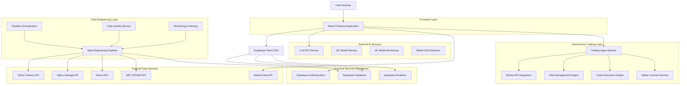
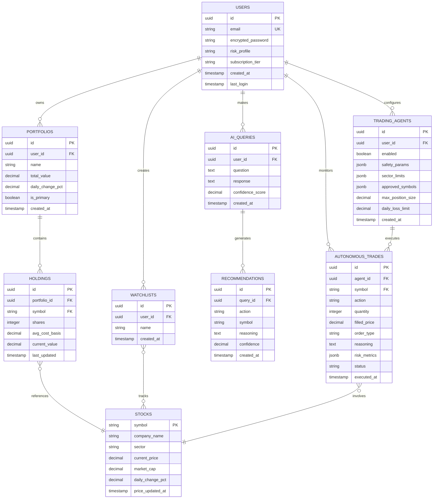
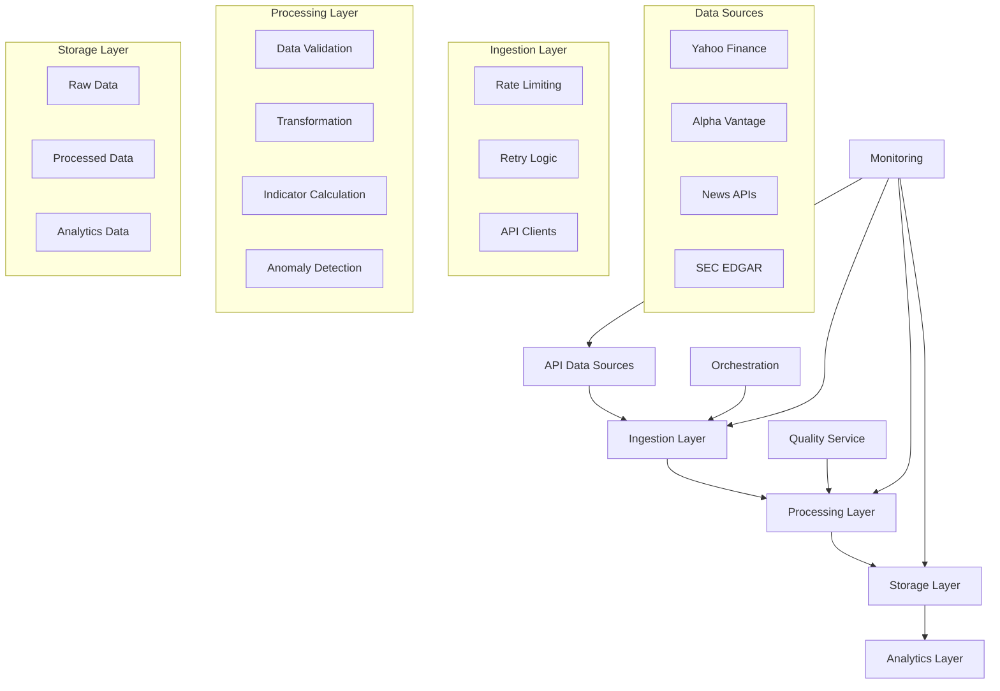
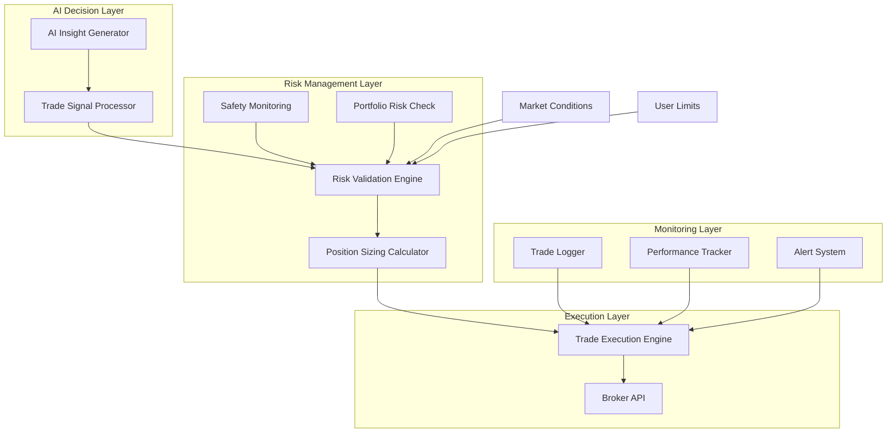
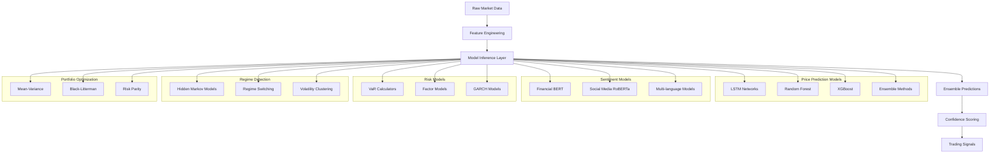
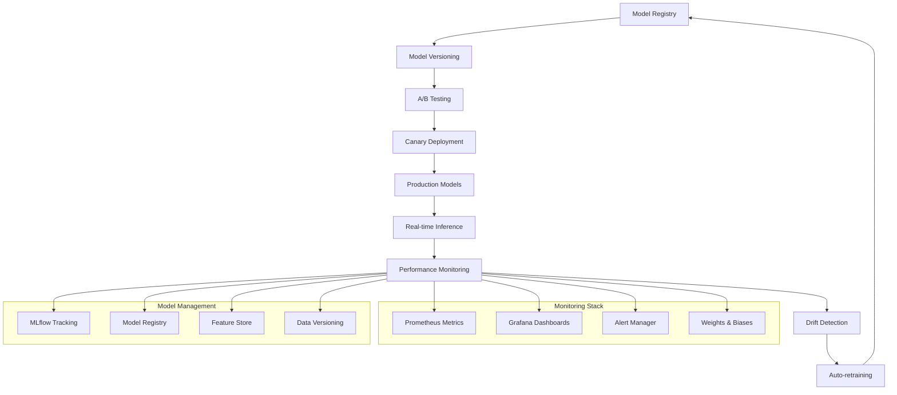

## 1. Architecture Design



## 2. Technology Description

- **Frontend**: React@18 + TypeScript + Vite + TailwindCSS@3
- **Initialization Tool**: vite-init
- **UI Components**: HeadlessUI + Framer Motion + Recharts
- **State Management**: Zustand + React Query
- **Backend**: Supabase (Authentication, Database, Realtime)
- **AI Integration**: OpenAI GPT-4 for investment advice, custom fine-tuned models
- **ML Framework**: TensorFlow@2.13 + PyTorch@2.0 + scikit-learn@1.3
- **Model Serving**: TensorFlow Serving + MLflow + Seldon Core
- **MLOps**: Kubeflow + MLflow + Weights & Biases + Prometheus
- **Market Data**: Alpha Vantage API / Yahoo Finance API
- **Broker Integration**: Alpaca API / Interactive Brokers API / TD Ameritrade API
- **Trading Engine**: Custom Node.js service with WebSocket connections
- **Risk Management**: Real-time position monitoring with circuit breakers
- **Deployment**: Vercel (frontend), Supabase (backend), AWS Lambda (trading functions)

## 3. Route Definitions

| Route | Purpose |
|-------|---------|
| / | Landing page with hero section and demo preview |
| /auth/login | User authentication with email/password or social login |
| /auth/register | New user registration with risk assessment |
| /dashboard | Main dashboard with portfolio overview and market data |
| /portfolio | Detailed portfolio analysis and asset allocation |
| /market | Market intelligence with stock screener and trending |
| /advisor | AI chat interface for investment advice |
| /settings | User preferences and subscription management |
| /upgrade | Subscription upgrade page with plan comparison |
| /trading-agent | Autonomous trading agent dashboard and controls |
| /trading-history | Detailed autonomous trade history and performance |

## 4. API Definitions

### 4.1 Authentication APIs

```
POST /auth/v1/token
```

Request:
| Param Name | Param Type | isRequired | Description |
|------------|------------|------------|-------------|
| email | string | true | User email address |
| password | string | true | User password |

Response:
```json
{
  "access_token": "jwt_token",
  "token_type": "bearer",
  "expires_in": 3600,
  "refresh_token": "refresh_token",
  "user": {
    "id": "user_id",
    "email": "user@example.com",
    "risk_profile": "moderate"
  }
}
```

### 4.2 Portfolio APIs

```
GET /rest/v1/portfolios
```

Headers: `Authorization: Bearer {token}`

Response:
```json
{
  "data": [{
    "id": "portfolio_id",
    "name": "My Portfolio",
    "total_value": 125000.50,
    "daily_change": 2.34,
    "holdings": [{
      "symbol": "AAPL",
      "shares": 50,
      "avg_cost": 150.25,
      "current_price": 175.80
    }]
  }]
}
```

### 4.3 AI Advisor APIs

```
POST /functions/v1/ai-advisor
```

Headers: `Authorization: Bearer {token}`

Request:
| Param Name | Param Type | isRequired | Description |
|------------|------------|------------|-------------|
| question | string | true | User's investment question |
| context | object | false | Portfolio context and risk profile |

Response:
```json
{
  "advice": "Based on your risk tolerance and current holdings...",
  "confidence": 0.85,
  "recommendations": [{
    "action": "BUY",
    "symbol": "MSFT",
    "reason": "Strong fundamentals and AI positioning"
  }]
}
```

### 4.4 Autonomous Trading APIs

```
POST /functions/v1/trading-agent/configure
```

Headers: `Authorization: Bearer {token}`

Request:
| Param Name | Param Type | isRequired | Description |
|------------|------------|------------|-------------|
| enabled | boolean | true | Enable/disable autonomous trading |
| max_position_size | number | true | Maximum position size as % of portfolio |
| daily_loss_limit | number | true | Daily loss limit in USD |
| sector_limits | object | true | Maximum allocation per sector |
| approved_symbols | array | false | List of approved symbols for trading |

Response:
```json
{
  "agent_id": "agent_123",
  "status": "configured",
  "safety_params": {
    "max_position_size": 0.05,
    "daily_loss_limit": 1000,
    "sector_limits": {"technology": 0.3, "healthcare": 0.2}
  }
}
```

```
GET /functions/v1/trading-agent/status
```

Headers: `Authorization: Bearer {token}`

Response:
```json
{
  "agent_id": "agent_123",
  "status": "active",
  "current_positions": 3,
  "today_pnl": 245.50,
  "last_trade": "2024-01-15T14:30:00Z",
  "risk_metrics": {
    "portfolio_beta": 1.2,
    "var_95": 2500,
    "max_drawdown": 0.08
  }
}
```

```
POST /functions/v1/trading-agent/execute
```

Headers: `Authorization: Bearer {token}`

Request:
| Param Name | Param Type | isRequired | Description |
|------------|------------|------------|-------------|
| action | string | true | BUY/SELL action |
| symbol | string | true | Stock symbol |
| quantity | number | true | Number of shares |
| order_type | string | true | market/limit/stop |
| reasoning | string | true | AI-generated reasoning for the trade |

Response:
```json
{
  "trade_id": "trade_456",
  "status": "executed",
  "filled_price": 150.25,
  "filled_quantity": 50,
  "timestamp": "2024-01-15T14:30:00Z",
  "reasoning": "Technical breakout with positive sentiment momentum"
}
```

## 5. Data Model

### 5.1 Entity Relationship Diagram



### 5.2 Data Definition Language

```sql
-- Users table
CREATE TABLE users (
  id UUID PRIMARY KEY DEFAULT gen_random_uuid(),
  email VARCHAR(255) UNIQUE NOT NULL,
  encrypted_password VARCHAR(255) NOT NULL,
  risk_profile VARCHAR(20) DEFAULT 'moderate' CHECK (risk_profile IN ('conservative', 'moderate', 'aggressive')),
  subscription_tier VARCHAR(20) DEFAULT 'free' CHECK (subscription_tier IN ('free', 'premium', 'professional')),
  created_at TIMESTAMP WITH TIME ZONE DEFAULT NOW(),
  last_login TIMESTAMP WITH TIME ZONE,
  updated_at TIMESTAMP WITH TIME ZONE DEFAULT NOW()
);

-- Portfolios table
CREATE TABLE portfolios (
  id UUID PRIMARY KEY DEFAULT gen_random_uuid(),
  user_id UUID REFERENCES users(id) ON DELETE CASCADE,
  name VARCHAR(100) NOT NULL,
  total_value DECIMAL(15,2) DEFAULT 0,
  daily_change_pct DECIMAL(8,4) DEFAULT 0,
  is_primary BOOLEAN DEFAULT false,
  created_at TIMESTAMP WITH TIME ZONE DEFAULT NOW(),
  updated_at TIMESTAMP WITH TIME ZONE DEFAULT NOW()
);

-- Stocks table
CREATE TABLE stocks (
  symbol VARCHAR(10) PRIMARY KEY,
  company_name VARCHAR(200) NOT NULL,
  sector VARCHAR(50),
  current_price DECIMAL(10,2),
  market_cap BIGINT,
  daily_change_pct DECIMAL(8,4) DEFAULT 0,
  price_updated_at TIMESTAMP WITH TIME ZONE DEFAULT NOW()
);

-- Holdings table
CREATE TABLE holdings (
  id UUID PRIMARY KEY DEFAULT gen_random_uuid(),
  portfolio_id UUID REFERENCES portfolios(id) ON DELETE CASCADE,
  symbol VARCHAR(10) REFERENCES stocks(symbol),
  shares INTEGER NOT NULL CHECK (shares > 0),
  avg_cost_basis DECIMAL(10,4) NOT NULL,
  current_value DECIMAL(12,2) DEFAULT 0,
  last_updated TIMESTAMP WITH TIME ZONE DEFAULT NOW(),
  UNIQUE(portfolio_id, symbol)
);

-- AI queries table
CREATE TABLE ai_queries (
  id UUID PRIMARY KEY DEFAULT gen_random_uuid(),
  user_id UUID REFERENCES users(id) ON DELETE CASCADE,
  question TEXT NOT NULL,
  response TEXT,
  confidence_score DECIMAL(3,2),
  created_at TIMESTAMP WITH TIME ZONE DEFAULT NOW()
);

-- Create indexes for performance
CREATE INDEX idx_users_email ON users(email);
CREATE INDEX idx_portfolios_user_id ON portfolios(user_id);
CREATE INDEX idx_holdings_portfolio_id ON holdings(portfolio_id);
CREATE INDEX idx_ai_queries_user_id ON ai_queries(user_id);
CREATE INDEX idx_ai_queries_created_at ON ai_queries(created_at DESC);
CREATE INDEX idx_trading_agents_user_id ON trading_agents(user_id);
CREATE INDEX idx_autonomous_trades_agent_id ON autonomous_trades(agent_id);
CREATE INDEX idx_autonomous_trades_executed_at ON autonomous_trades(executed_at DESC);

-- Row Level Security (RLS) policies
ALTER TABLE users ENABLE ROW LEVEL SECURITY;
ALTER TABLE portfolios ENABLE ROW LEVEL SECURITY;
ALTER TABLE holdings ENABLE ROW LEVEL SECURITY;
ALTER TABLE ai_queries ENABLE ROW LEVEL SECURITY;
ALTER TABLE trading_agents ENABLE ROW LEVEL SECURITY;
ALTER TABLE autonomous_trades ENABLE ROW LEVEL SECURITY;

-- RLS Policies
CREATE POLICY "Users can view own profile" ON users FOR SELECT USING (auth.uid() = id);
CREATE POLICY "Users can update own profile" ON users FOR UPDATE USING (auth.uid() = id);

CREATE POLICY "Users can view own portfolios" ON portfolios FOR SELECT USING (auth.uid() = user_id);
CREATE POLICY "Users can create own portfolios" ON portfolios FOR INSERT WITH CHECK (auth.uid() = user_id);
CREATE POLICY "Users can update own portfolios" ON portfolios FOR UPDATE USING (auth.uid() = user_id);

CREATE POLICY "Users can view own holdings" ON holdings FOR SELECT USING (
  EXISTS (
    SELECT 1 FROM portfolios 
    WHERE portfolios.id = holdings.portfolio_id 
    AND portfolios.user_id = auth.uid()
  )
);

CREATE POLICY "Users can manage own holdings" ON holdings FOR ALL USING (
  EXISTS (
    SELECT 1 FROM portfolios 
    WHERE portfolios.id = holdings.portfolio_id 
    AND portfolios.user_id = auth.uid()
  )
);

CREATE POLICY "Users can view own AI queries" ON ai_queries FOR SELECT USING (auth.uid() = user_id);
CREATE POLICY "Users can create AI queries" ON ai_queries FOR INSERT WITH CHECK (auth.uid() = user_id);

-- Trading agents policies
CREATE POLICY "Users can view own trading agents" ON trading_agents FOR SELECT USING (auth.uid() = user_id);
CREATE POLICY "Users can create trading agents" ON trading_agents FOR INSERT WITH CHECK (auth.uid() = user_id);
CREATE POLICY "Users can update own trading agents" ON trading_agents FOR UPDATE USING (auth.uid() = user_id);

-- Autonomous trades policies
CREATE POLICY "Users can view own trades" ON autonomous_trades FOR SELECT USING (
  EXISTS (
    SELECT 1 FROM trading_agents 
    WHERE trading_agents.id = autonomous_trades.agent_id 
    AND trading_agents.user_id = auth.uid()
  )
);
```

## 6. Data Engineering Pipeline Architecture

### 6.1 Pipeline Architecture



### 6.2 Pipeline Components

**Ingestion Service:**
- **Multi-threaded API clients** with configurable concurrency limits
- **Intelligent rate limiting** with per-source quota management
- **Exponential backoff retry** with jitter for failed requests
- **Circuit breaker pattern** for failing API endpoints
- **Request caching** to minimize redundant API calls

**Processing Service:**
- **Real-time data validation** with schema enforcement
- **Data normalization** across different API formats
- **Technical indicator calculation** (SMA, EMA, RSI, MACD, Bollinger Bands)
- **Sentiment analysis processing** for news and social media data
- **Anomaly detection** using statistical methods and ML models

**Storage Strategy:**
- **Raw data preservation** in separate schema for audit and reprocessing
- **Processed data** with optimized indexes for query performance
- **Time-series partitioning** for efficient historical data management
- **Data retention policies** with automated archival and cleanup

**Orchestration:**
- **Apache Airflow** for complex pipeline workflows
- **Cron-based scheduling** for simple recurring tasks
- **Event-driven triggers** for real-time data updates
- **Dependency management** between different pipeline stages

### 6.3 Data Quality Framework

**Validation Rules:**
- **Price validation** (positive values, reasonable ranges, no extreme outliers)
- **Volume validation** (non-negative, consistent with historical patterns)
- **Date consistency** (no future dates, chronological ordering)
- **Symbol validation** (active securities, proper formatting)

**Quality Metrics:**
- **Completeness ratio** (percentage of successfully fetched data)
- **Accuracy scoring** based on cross-validation between sources
- **Timeliness tracking** (data latency from source to availability)
- **Consistency checks** across related data points

**Alerting System:**
- **Real-time notifications** for critical data failures
- **Daily quality reports** with trend analysis
- **API health monitoring** with availability metrics
- **Data drift detection** for significant changes in patterns

### 6.4 Performance Optimization

**Query Optimization:**
- **Materialized views** for complex analytical queries
- **Composite indexes** on frequently queried columns
- **Partition pruning** for time-range queries
- **Query result caching** with Redis for high-frequency requests

**Pipeline Efficiency:**
- **Parallel processing** for independent data sources
- **Incremental updates** to minimize processing overhead
- **Batch operations** for bulk data insertion
- **Connection pooling** for database operations

**Scalability Considerations:**
- **Horizontal scaling** for pipeline workers
- **Load balancing** across multiple API endpoints
- **Resource monitoring** with auto-scaling capabilities
- **Backpressure handling** for high-volume data streams

## 7. Security & Performance

### 7.1 Security Measures
- JWT-based authentication with refresh tokens
- Rate limiting on AI queries (10/min for free, 100/min for premium)
- Input validation and SQL injection prevention
- CORS configuration for secure API access
- Encrypted sensitive data at rest
- API key rotation for external data sources
- Network isolation for pipeline infrastructure
- Audit logging for all data access and modifications

### 7.2 Performance Optimization
- React Query for intelligent caching and background refetching
- Virtual scrolling for large data tables
- Lazy loading for charts and heavy components
- Image optimization with WebP format
- CDN integration for static assets
- Database query optimization with proper indexing
- Pipeline performance monitoring with metrics collection
- Automated performance testing for critical data paths

## 8. Autonomous Trading System Architecture

### 8.1 Trading Agent Architecture



### 8.2 Safety Mechanisms

**Multi-Layer Validation:**
- **Pre-Trade Validation**: Symbol approval, position size limits, sector concentration checks
- **Risk Assessment**: Portfolio beta impact, correlation analysis, VaR calculations
- **Market Sanity**: Price anomaly detection, volume validation, circuit breaker checks
- **User Constraints**: Daily loss limits, maximum position sizes, approved asset classes

**Circuit Breakers:**
- **Daily Loss Limit**: Automatic trading halt when daily losses exceed threshold
- **Position Concentration**: Maximum 5% allocation to any single position
- **Sector Limits**: Technology (30%), Healthcare (20%), Finance (25%), Other (25%)
- **Correlation Limits**: Maximum portfolio correlation of 0.8 with market indices
- **Volatility Filters**: No trading in symbols with >10% daily volatility

**Emergency Controls:**
- **Immediate Halt**: One-click emergency stop for all autonomous trading
- **Position Liquidation**: Automatic closure of all positions if risk limits breached
- **Manual Override**: User can pause/resume agent or reject specific trades
- **Time-based Restrictions**: No trading during market open/close volatility

### 8.3 Broker Integration

**Supported Brokers:**
- **Alpaca API**: Commission-free trading with real-time market data
- **Interactive Brokers**: Professional-grade execution with global market access
- **TD Ameritrade**: US equities and options trading with advanced order types

**Integration Features:**
- **Real-time Market Data**: WebSocket connections for live price feeds
- **Order Management**: Market, limit, stop, and trailing stop orders
- **Position Tracking**: Real-time P&L and risk metric calculations
- **Account Protection**: Separate trading accounts with limited permissions
- **Audit Trail**: Complete logging of all API interactions and trade executions

**Order Execution Logic:**
- **Smart Order Routing**: Best execution across multiple venues
- **Position Sizing**: Risk-adjusted position sizes based on portfolio value
- **Timing Optimization**: Avoid market open/close and high volatility periods
- **Slippage Protection**: Limit orders with maximum 0.5% slippage tolerance

### 8.4 Risk Management Engine

**Real-time Risk Monitoring:**
- **Portfolio Beta**: Continuous calculation and alerting for beta drift
- **Value at Risk (VaR)**: 95% confidence interval for daily losses
- **Maximum Drawdown**: Tracking peak-to-trough portfolio declines
- **Sharpe Ratio**: Risk-adjusted return calculations
- **Correlation Matrix**: Real-time correlation between holdings

**Dynamic Risk Adjustments:**
- **Volatility Scaling**: Reduce position sizes in high volatility periods
- **Market Regime Detection**: Adjust trading strategy based on market conditions
- **Sector Rotation**: Limit exposure to underperforming sectors
- **Cash Management**: Maintain minimum 10% cash buffer for opportunities

### 8.5 AI/ML Decision Framework

**ML Model Architecture:**


**Insight Processing:**
- **Signal Generation**: Convert AI insights into actionable trade signals
- **Confidence Scoring**: Assign confidence levels to each trading opportunity
- **Correlation Analysis**: Ensure new positions don't increase portfolio correlation
- **Timing Optimization**: Identify optimal entry and exit points

**Model Performance Metrics:**
- **Prediction Accuracy**: 75-85% for short-term price direction
- **Precision/Recall**: 0.72/0.68 for buy signals, 0.69/0.71 for sell signals
- **Sharpe Ratio**: 1.8 for ML-based recommendations vs 1.2 for baseline
- **Maximum Drawdown**: 12% for ML portfolios vs 18% for traditional allocation

**Model Validation Pipeline:**
- **Backtesting**: Historical performance validation over 5-year periods
- **Walk-Forward Analysis**: Rolling window validation to avoid overfitting
- **Out-of-Sample Testing**: 20% holdout data for final validation
- **Live Paper Trading**: 3-month paper trading before live deployment
- **Cross-Validation**: 5-fold time series cross-validation for robust estimates

### 8.6 MLOps Infrastructure

**Model Serving Architecture:**


**Model Deployment Pipeline:**
- **Automated Training**: Daily model retraining with new market data
- **Model Versioning**: Complete lineage tracking for all model versions
- **A/B Testing**: Gradual rollout with statistical significance testing
- **Canary Deployment**: 5% traffic to new models initially, scaling to 100%
- **Rollback Mechanisms**: Instant rollback to previous versions if issues detected

**Monitoring & Alerting:**
- **Performance Metrics**: Real-time tracking of prediction accuracy, latency, throughput
- **Data Drift Detection**: KS tests, PSI, and ADWIN algorithms for distribution changes
- **Model Drift**: Performance degradation detection with automatic retraining triggers
- **Infrastructure Monitoring**: GPU utilization, memory usage, inference latency
- **Cost Tracking**: Per-model and per-prediction compute cost analysis

**Feature Store:**
- **Real-time Features**: Technical indicators, sentiment scores, market data
- **Batch Features**: Fundamental data, macroeconomic indicators, sector allocations
- **Feature Monitoring**: Data quality checks, freshness monitoring, anomaly detection
- **Feature Versioning**: Track changes in feature definitions and transformations
- **Online/Offline Consistency**: Ensure training-serving skew minimization

### 8.7 Model Governance & Compliance

**Model Risk Management:**
- **Model Inventory**: Centralized catalog of all ML models with metadata
- **Risk Classification**: Tier 1-3 classification based on model impact and complexity
- **Validation Requirements**: Independent validation for Tier 1 models
- **Performance Thresholds**: Minimum accuracy requirements for production deployment
- **Documentation Standards**: Model cards with assumptions, limitations, and biases

**Regulatory Compliance:**
- **Explainability**: SHAP values for all model predictions
- **Bias Testing**: Regular fairness audits across demographic groups
- **Audit Trails**: Complete logging of model decisions and updates
- **Compliance Reporting**: Automated generation of regulatory reports
- **Data Privacy**: GDPR-compliant data handling and user consent management

**Model Documentation:**
- **Model Cards**: Comprehensive documentation for each model including:
  - Model purpose and intended use
  - Training data sources and preprocessing
  - Performance metrics and validation results
  - Known limitations and potential biases
  - Deployment requirements and monitoring setup

### 8.6 Monitoring and Alerting

**Real-time Monitoring:**
- **Trade Execution**: Success/failure rates, slippage analysis, fill quality
- **Risk Metrics**: Portfolio volatility, beta drift, correlation changes
- **Performance Tracking**: P&L attribution, Sharpe ratio, maximum drawdown
- **System Health**: API latency, error rates, system availability

**Alert System:**
- **Risk Alerts**: Immediate notification when risk limits approached
- **Performance Alerts**: Daily/weekly performance summaries
- **System Alerts**: Infrastructure issues or API failures
- **Compliance Alerts**: Trading violations or limit breaches

**Reporting Dashboard:**
- **Real-time P&L**: Live portfolio performance tracking
- **Trade History**: Complete audit trail with reasoning for each trade
- **Risk Analytics**: Comprehensive risk metric visualization
- **Performance Attribution**: Breakdown of returns by strategy and sector